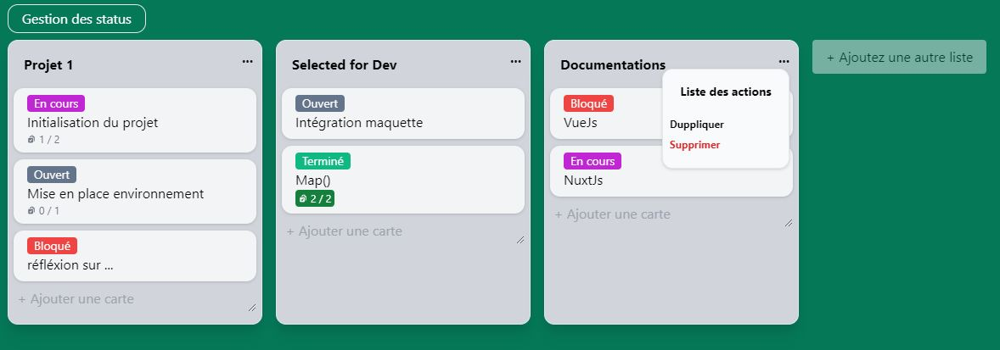
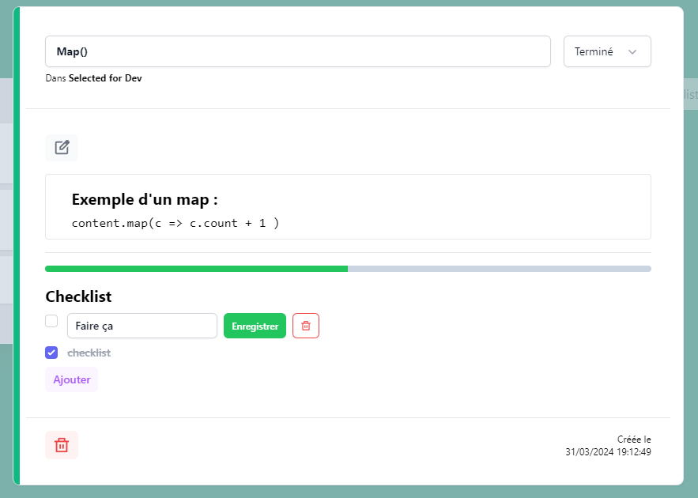

# TRELLO (bis) APP

Tester en live : [go live](https://trello-fun.vercel.app/)

## Todo list
- [X] Gestion avec Pinia
- [X] Columns
  -  [X] Create
  -  [X] Delete
  -  [X] Modify
  -  [X] Drag & Drop
- [X] Rows
    -  [X] Create
    -  [X] Delete
    -  [X] Modify
    -  [X] Modification du contenu (Prise en charge markDown)
    -  [X] Drag & Drop (Dupplicate with Alt touch)
    -  [X] Checklist Task
- [X] Statut
  - [X] Ajouter
  - [X] Supprimer
  - [X] Renomer
  - [X] Gestion de la couleur

- [ ] Authentification
- [ ] Back-end (à Faire)
  - [ ] CRUD

